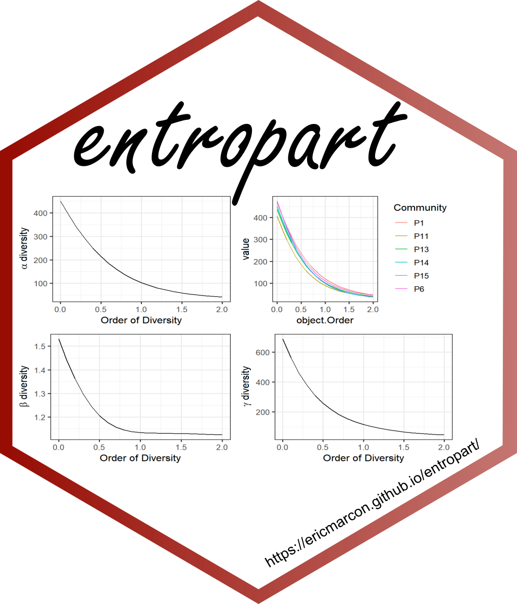
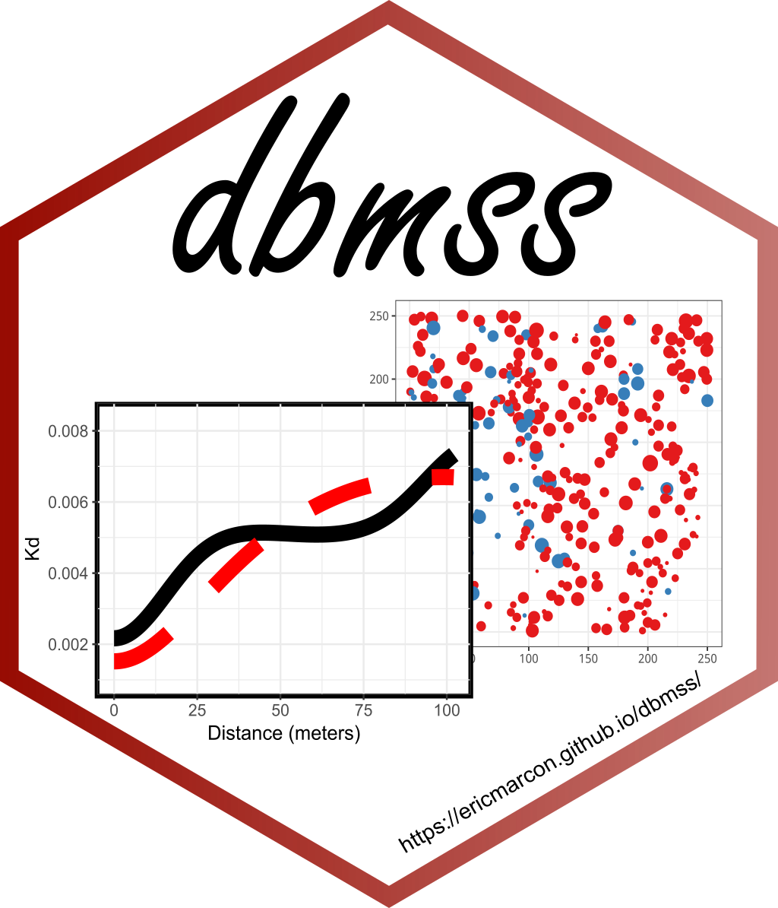

```{r}
#| label: DoNotModify
#| include: false
### Utilities. Do not modify.
# Installation of packages if necessary
InstallPackages <- function(Packages) {
  InstallPackage <- function(Package) {
    if (!Package %in% installed.packages()[, 1]) {
      install.packages(Package, repos = "https://cran.rstudio.com/")
    }
  }
  invisible(sapply(Packages, InstallPackage))
}

# Basic packages
InstallPackages(c("bookdown", "formatR", "kableExtra", "ragg"))

# Chunk font size hook: allows size='small' or any valid Latex font size in chunk options
def.chunk.hook  <- knitr::knit_hooks$get("chunk")
knitr::knit_hooks$set(chunk = function(x, options) {
  x <- def.chunk.hook(x, options)
  ifelse(options$size != "normalsize", paste0("\n \\", options$size,"\n\n", x, "\n\n \\normalsize"), x)
})
```

```{r}
#| label: Options
#| include: false
### Customized options for this document
# Add necessary packages here
Packages <- c("tidyverse", "entropart", "dbmss", "memoiR")
# Install them
InstallPackages(Packages)

# knitr options
knitr::opts_chunk$set(
  cache =   FALSE,    # Cache chunk results
  include = TRUE,     # Show/Hide chunks
  echo =    FALSE,    # Show/Hide code
  warning = FALSE,    # Show/Hide warnings
  message = FALSE,    # Show/Hide messages
  # Figure alignment and size
  fig.align = 'center', out.width = '80%',
  # Graphic devices (ragg_png is better than standard png)
  dev = c("ragg_png", "pdf"),
  # Code chunk format
  tidy = TRUE, tidy.opts = list(blank = FALSE, width.cutoff = 50),
  size = "scriptsize", knitr.graphics.auto_pdf = TRUE
)
options(width = 50)

# ggplot style
library("tidyverse")
theme_set(theme_bw())
theme_update(
  panel.background = element_rect(fill = "transparent", colour = NA),
  plot.background = element_rect(fill = "transparent", colour = NA)
)
knitr::opts_chunk$set(dev.args = list(bg = "transparent"))

# Tibbles: 5 lines, fit to slide width
options(tibble.print_min = 5, tibble.width = 50)

# Random seed
set.seed(973)
```


# Packages 

## entropart{.columns-2} 

\begincols
  \begincol{.58\textwidth}

Mesures de la biodiversité.

Sur [Github](https://ericmarcon.github.io/entropart/)

Publié dans [Journal of Statitical Software](https://www.jstatsoft.org/article/view/v067i08)


Sur CRAN

  \endcol
  \begincol{.38\textwidth}
  <p class="forceBreak"></p>

```{r}
#| out-width: 90%

```

  \endcol
\endcols

## entropart

```{r}
#| echo: true
library("entropart")
DivProfile(seq(0, 2, 0.1), Paracou618.MC) |>
  autoplot()
```

## dbmss{.columns-2} 

\begincols
  \begincol{.58\textwidth}

Statistiques spatiales non paramétriques.

Sur [Github](https://ericmarcon.github.io/dbmss/)

Publié dans [Journal of Statitical Software](https://www.jstatsoft.org/article/view/v067c03)


Sur CRAN

  \endcol
  \begincol{.38\textwidth}
  <p class="forceBreak"></p>

```{r}
#| out-width: 90%

```

  \endcol
\endcols

## dbmss

```{r}
#| echo: true
library("dbmss")
# Plot (second column of marks is Point Types) 
paracou16 |>
  autoplot(
    labelSize = expression("Basal area (" ~cm^2~ ")"), 
    labelColor = "Species"
  )
```

## dbmss

```{r}
#| echo: true
paracou16 |> 
  MEnvelope(ReferenceType = "V. Americana", NeighborType = "Q. Rosea") |> 
  autoplot(main = "") + ggplot2::ylim(0, 2)
```

## memoiR{.columns-2} 

\begincols
  \begincol{.58\textwidth}

Modèles et utilitaires pour la publication de documents reproductibles.

Sur [Github](https://ericmarcon.github.io/memoiR/)

Soumis au [Journal of Open Source Education](https://github.com/openjournals/jose-papers/blob/jose.00228/jose.00228/10.21105.jose.00228.pdf)

Sur CRAN

  \endcol
  \begincol{.38\textwidth}
  <p class="forceBreak"></p>

```{r}
#| out-width: 90%

```

  \endcol
\endcols


## memoiR

Modèles de :

- documents longs : [Travailler avec R](https://github.com/EricMarcon/travailleR) et [Mesures de la Biodiversité](https://github.com/EricMarcon/MesuresBioDiv2). 
- articles : [Marcon et al. (2024)](https://github.com/EricMarcon/JTE-22-105)
- (cette) [présentation]()

Conçu pour produire en HTML et PDF.

Optimisé pour GitHub : facilite l'intégration continue, gère les langues en LaTeX...


# Perspectives

## Suite logicielle

Simulation et traitement de données d'inventaire forestier :

- [rcontroll](https://github.com/sylvainschmitt/rcontroll) simule la dynamique,
- [LoggingLab](https://github.com/VincyaneBadouard/LoggingLab) simule l'exploitation,
- [entropart](https://github.com/EricMarcon/entropart) mesure la diversité,
- [dbmss](https://github.com/EricMarcon/dbmss) caractérise la structure spatiale,
- [BIOMASS](https://github.com/umr-amap/BIOMASS) estime la biomasse...

Qualité et pérennité pas très robustes

Création d'une suite logicielle ? Modèle : [easystats](https://github.com/easystats)


<!-- Styles for HTML slides -->
<!-- https://stackoverflow.com/questions/38260799/references-page-truncated-in-rmarkdown-ioslides-presentation/38294541#38294541 -->
<style>
  .forceBreak { -webkit-column-break-after: always; break-after: column; }
  slides > slide { overflow: scroll; }
  slides > slide:not(.nobackground):after { content: ''; }
</style>
